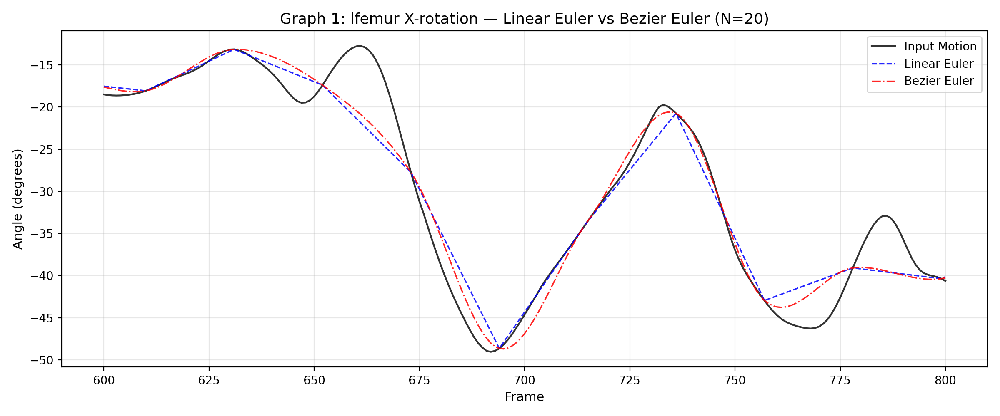
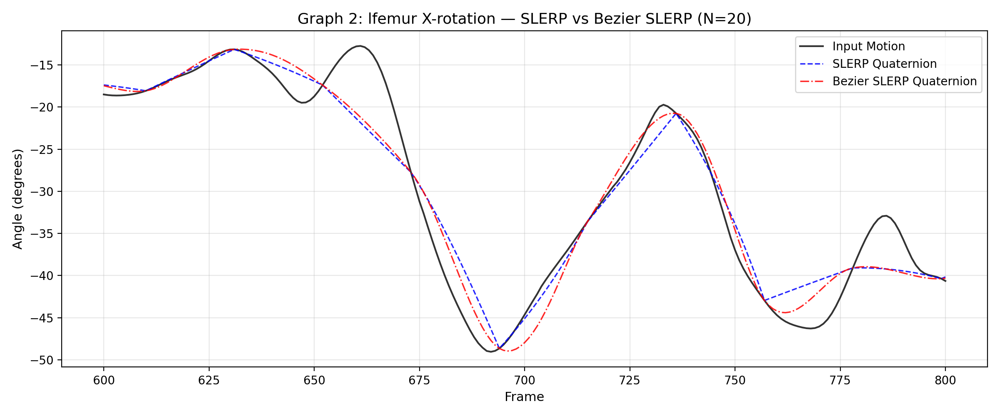
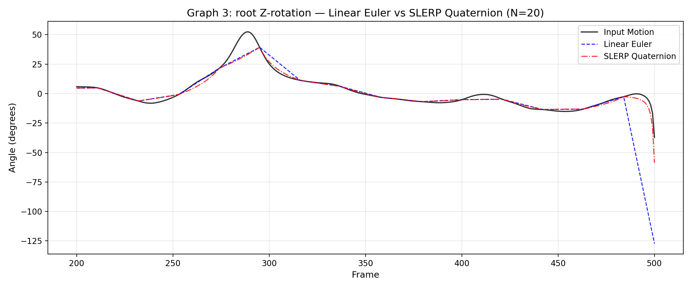
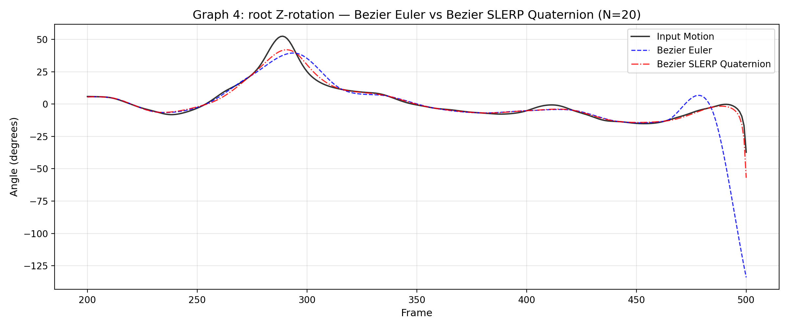
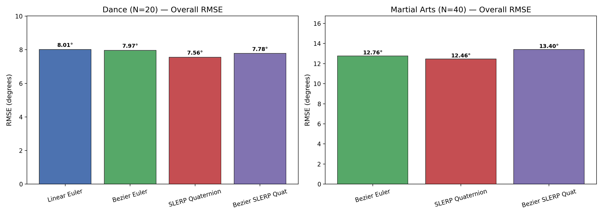
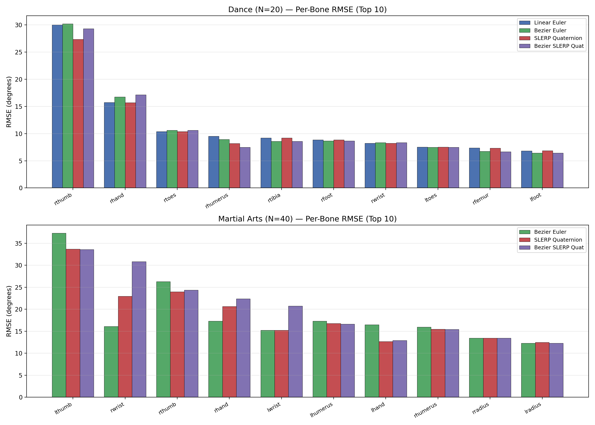
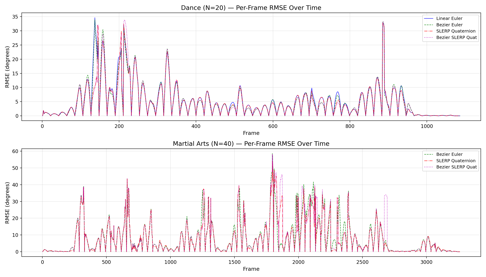
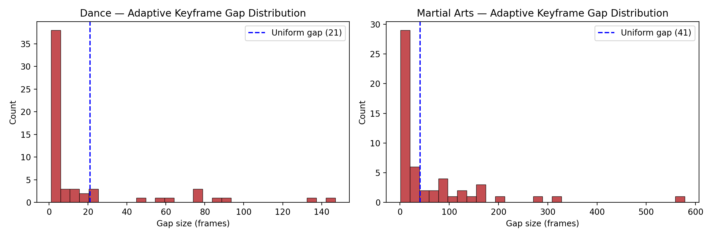
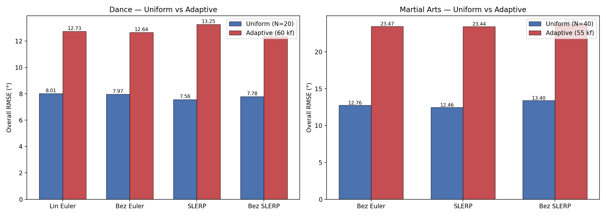

# CSCI 520 — Assignment 2: Motion Capture Interpolation

## Overview

This project implements motion capture interpolation for the CSCI 520 Computer Animation and Simulation course. Given a skeleton (ASF) and motion capture data (AMC) at 120 fps, the system drops N consecutive frames to form a sparse keyframe sequence, then reconstructs the full motion using various interpolation techniques. The interpolated result is compared against the original to evaluate each method's accuracy.

Four interpolation methods are supported:
- **Linear Euler** (provided as starter code)
- **Bezier Euler** — cubic Bezier splines over Euler angle channels
- **SLERP Quaternion** — spherical linear interpolation on the quaternion hypersphere
- **Bezier SLERP Quaternion** — Bezier splines evaluated with SLERP in quaternion space

## Build Instructions

### Prerequisites
- macOS (tested on macOS 15)
- FLTK 1.3.8 (included in `fltk-1.3.8/`)
- Python 3 with matplotlib and numpy (for analysis scripts)
- ffmpeg (for video encoding)

### Building FLTK
```bash
cd fltk-1.3.8
make
```

### Building the Project
```bash
cd mocapPlayer-starter
make
```

This produces two executables:
- `mocapPlayer` — the OpenGL motion capture viewer
- `interpolate` — the command-line interpolation tool

## Usage

### Uniform Interpolation (Standard)

```bash
./interpolate <skeleton.asf> <motion.amc> <l|b> <e|q> <N> <output.amc>
```

- `l` = linear, `b` = Bezier
- `e` = Euler angles, `q` = quaternions
- `N` = number of consecutive frames to drop

**Examples:**
```bash
# Linear Euler, N=20, dance
./interpolate 131-dance.asf 131_04-dance.amc l e 20 output/dance-le-N20.amc

# Bezier Euler, N=20, dance
./interpolate 131-dance.asf 131_04-dance.amc b e 20 output/dance-be-N20.amc

# SLERP Quaternion, N=20, dance
./interpolate 131-dance.asf 131_04-dance.amc l q 20 output/dance-lq-N20.amc

# Bezier SLERP Quaternion, N=20, dance
./interpolate 131-dance.asf 131_04-dance.amc b q 20 output/dance-bq-N20.amc

# Bezier Euler, N=40, martial arts
./interpolate 135-martialArts.asf 135_06-martialArts.amc b e 40 output/martial-be-N40.amc

# SLERP Quaternion, N=40, martial arts
./interpolate 135-martialArts.asf 135_06-martialArts.amc l q 40 output/martial-lq-N40.amc

# Bezier SLERP Quaternion, N=40, martial arts
./interpolate 135-martialArts.asf 135_06-martialArts.amc b q 40 output/martial-bq-N40.amc
```

### Non-Uniform Interpolation (Extra Credit)

First, generate an adaptive keyframe file:
```bash
python3 generate_keyframes.py <motion.amc> <num_keyframes> <output_keyframes.txt>
```

Then run interpolation with the `-k` flag:
```bash
./interpolate <skeleton.asf> <motion.amc> <l|b> <e|q> -k <keyframes.txt> <output.amc>
```

**Examples:**
```bash
# Generate 60 adaptive keyframes for dance
python3 generate_keyframes.py 131_04-dance.amc 60 output/keyframes_dance_adaptive.txt

# Bezier SLERP with adaptive keyframes
./interpolate 131-dance.asf 131_04-dance.amc b q -k output/keyframes_dance_adaptive.txt output/dance-bq-adaptive.amc
```

### Viewing Results

```bash
./mocapPlayer
```

1. Load Skeleton (ASF file)
2. Load Motion (AMC file)
3. Use playback controls to view

To compare two motions side by side (input in red, interpolated in green):
1. Load skeleton + original motion
2. Load the same skeleton again + interpolated motion
3. Set tx=ty=tz=rx=ry=rz=0 so they overlap

### Generating Graphs

```bash
python3 plot_graphs.py          # 4 required comparison graphs
python3 error_analysis.py       # error analysis with 3 plots
python3 compare_uniform_adaptive.py  # uniform vs adaptive comparison plots
```

---

## Implemented Techniques

All three required interpolation techniques were successfully implemented in `interpolator.cpp`, in addition to the provided Linear Euler baseline.

**Bezier Euler Interpolation.** Cubic Bezier splines over Euler angle channels, with control points derived from Catmull-Rom tangents scaled by 1/3 (Shoemake section 4.4). De Casteljau's algorithm is used for evaluation. Instead of linearly blending between keyframes, this fits a smooth cubic curve that respects the trajectory's local shape.

**SLERP Quaternion Interpolation.** Euler angles at each keyframe are converted to quaternions via rotation matrices, then Spherical Linear Interpolation is performed on the unit quaternion hypersphere. The shorter arc is always chosen by flipping the quaternion sign when the dot product is negative, and a near-parallel fallback uses normalized linear blending to avoid division by zero.

**Bezier SLERP Quaternion Interpolation.** Bezier splines in quaternion space using Shoemake's construction: the Double() function reflects a neighbor quaternion through the current keyframe, SLERP to the midpoint gives the raw tangent direction, and a 1/3 compression step pulls the handle back toward the keyframe. De Casteljau evaluation is performed entirely with SLERP operations.

For both quaternion methods, root translation is still interpolated in Euler space (linear for SLERP, Bezier for Bezier SLERP), since quaternions only represent rotations.

---

## Required Graphs

All graphs use `131_04-dance.amc` with N=20. Each plot shows three curves: the input motion and two interpolation methods being compared.

### Graph 1: Linear Euler vs Bezier Euler — lfemur X-rotation, frames 600-800



Both methods track the input closely in this smooth, periodic region. Bezier Euler is slightly smoother between keyframes, while Linear Euler shows subtle kinks at keyframe boundaries where the slope changes abruptly. The differences are minor because this part of the dance has relatively gentle femur rotation.

### Graph 2: SLERP vs Bezier SLERP — lfemur X-rotation, frames 600-800



Both quaternion methods follow the input very closely — the curves are nearly indistinguishable after converting back to Euler angles for plotting. Bezier SLERP provides marginally smoother keyframe transitions, but for this joint and frame range, the improvement is subtle.

### Graph 3: Linear Euler vs SLERP Quaternion — root Z-rotation, frames 200-500



This is where the methods start to diverge noticeably. Around frames 480-500, the root undergoes rapid Z-rotation changes. Linear Euler takes a straight-line path through angle space, which doesn't necessarily correspond to the shortest rotation. SLERP, working on the quaternion hypersphere, always follows the geodesic and stays closer to the input in these fast-changing regions.

### Graph 4: Bezier Euler vs Bezier SLERP — root Z-rotation, frames 200-500



A similar story to Graph 3. Both Bezier variants handle smooth sections well, but near the rapid orientation changes, Bezier SLERP maintains its advantage through quaternion-space interpolation. Bezier Euler can overshoot or oscillate in regions where the Euler angle parameterization becomes ill-conditioned.

---

## Required Videos

All videos use `135_06-martialArts.amc` with N=40. Input motion is shown in red, interpolated in green.

### Video 1: Input + Bezier Euler

https://github.com/user-attachments/assets/video1_be.mp4

<video src="output/video1_be.mp4" width="640" controls></video>

### Video 2: Input + SLERP Quaternion

https://github.com/user-attachments/assets/video2_lq.mp4

<video src="output/video2_lq.mp4" width="640" controls></video>

### Video 3: Input + Bezier SLERP Quaternion

https://github.com/user-attachments/assets/video3_bq.mp4

<video src="output/video3_bq.mp4" width="640" controls></video>

Across all three videos, the two skeletons align closely during slower movements. The real differences show up during fast kicks and arm strikes, where 40 consecutive frames of motion are missing. SLERP (Video 2) generally tracks the original most closely in these challenging sections.

---

## Analysis of Techniques

### Overall Performance

Error is measured using rotation-matrix angular distance — a representation-independent metric that avoids the pitfalls of comparing raw Euler angles. The metric computes the geodesic angle between two rotation matrices for each bone at each frame, then aggregates into an RMSE.

**Dance (N=20):**

| Method | Overall RMSE | Max Frame RMSE | Worst Frame |
|--------|-------------|----------------|-------------|
| Linear Euler | 8.01° | 34.65° | 137 |
| Bezier Euler | 7.97° | 33.91° | 137 |
| SLERP Quaternion | **7.56°** | 32.83° | 886 |
| Bezier SLERP Quat | 7.78° | 33.92° | 214 |

**Martial Arts (N=40):**

| Method | Overall RMSE | Max Frame RMSE | Worst Frame |
|--------|-------------|----------------|-------------|
| Bezier Euler | 12.76° | 58.55° | 1796 |
| SLERP Quaternion | **12.46°** | 53.91° | 1796 |
| Bezier SLERP Quat | 13.40° | 58.29° | 1796 |

SLERP Quaternion consistently achieves the lowest overall RMSE.



### Strengths and Weaknesses

**Linear Euler** is the simplest approach and works well for smooth, slow motion. It interpolates along straight lines in Euler angle space (which don't correspond to shortest rotation paths), is susceptible to gimbal lock, and produces C0-continuous motion with visible kinks at keyframe boundaries.

**Bezier Euler** fixes the continuity issue — the Catmull-Rom tangent construction gives C1 continuity, so motion flows smoothly through keyframes. However, it still operates in Euler angle space and inherits gimbal lock susceptibility. The cubic curve can also overshoot the true trajectory.

**SLERP Quaternion** was the best performer overall. By interpolating on the rotation manifold, it always takes the shortest path between two orientations and is immune to gimbal lock. The tradeoff is that it is only C0-continuous at keyframes, but in practice the geodesic property mattered more than tangent continuity.

**Bezier SLERP Quaternion** combines quaternion representation with Bezier smoothness, giving C1 continuity in quaternion space and the smoothest visual motion. Surprisingly, it does not always achieve the lowest RMSE — the Shoemake control point construction can overshoot in quaternion space, similar to how Bezier Euler overshoots in angle space.

### Per-Bone Error Distribution

Error is heavily concentrated in extremity joints. The thumb, hand, foot, and toe bones dominate the top-10 worst-error lists across all methods — these joints undergo rapid, small-amplitude articulations that are poorly captured when keyframes are sparse. Proximal joints are reconstructed much more accurately.



### Temporal Error Distribution

Errors spike at specific frames where the motion undergoes rapid changes. For dance, the worst region is around frame 137. For martial arts, frame 1796 is the worst across all methods — likely a fast kick or punch. Between these spikes, all methods perform comparably.



### Effect of N and Motion Type

The dance sequence (N=20) produces RMSE in the 7.5-8.0° range, while martial arts (N=40) jumps to 12.5-13.4°. This increase comes from both the larger N and the nature of the motion — martial arts involves explosive kicks and punches, whereas dance tends to be periodic and fluid. The worst single frame in martial arts reaches nearly 59° RMSE.

---

## Extra Credit

### 1. Quantitative Error Analysis

Implemented a comprehensive error analysis pipeline (`error_analysis.py`) that computes angular distance between rotation matrices rather than comparing raw Euler angles. This is critical because quaternion-to-Euler conversion can produce different but equivalent angle decompositions, making naive Euler comparison unreliable.

The analysis computes overall RMSE, per-frame RMSE, and per-bone RMSE, with three summary plots generated automatically.

### 2. Improved OpenGL Renderer

Two visual enhancements to `mocapPlayer.cpp`:

**Gradient sky background** — Replaced the flat white background with a smooth vertical gradient (dark blue at top to lighter blue-gray at horizon). Implemented as a screen-space orthographic quad with per-vertex colors, drawn before the 3D scene with depth testing disabled.

**Floor reflection** — Added a faint mirrored copy of the skeleton beneath the ground plane. The skeleton is rendered with Y-axis flipped, using dimmed lighting for subtlety. The ground plane is made semi-transparent (alpha = 0.85) so the reflection shows through.

### 3. Non-Uniform Keyframe Support

Extended the interpolation framework to support keyframes at irregular time intervals, with the idea that complex motion segments should receive denser keyframe coverage.

**Implementation:**
- Four new interpolation methods in `interpolator.cpp` that accept a sorted list of keyframe indices with variable spacing
- Extended `interpolate` driver with `-k <keyframe_file>` flag
- Adaptive keyframe selector (`generate_keyframes.py`) that scores frames by angular velocity and greedily allocates keyframes to high-importance regions

**Results — An Interesting Negative Finding:**

The adaptive selection performed worse than uniform sampling across all methods and both motions:

**Dance (60 adaptive keyframes vs ~51 uniform at N=20):**

| Method | Uniform RMSE | Adaptive RMSE |
|--------|-------------|---------------|
| Linear Euler | 8.01° | 12.73° |
| Bezier Euler | 7.97° | 12.64° |
| SLERP Quat | 7.56° | 13.25° |
| Bezier SLERP | 7.78° | 12.34° |

**Martial Arts (55 adaptive vs ~79 uniform at N=40):**

| Method | Uniform RMSE | Adaptive RMSE |
|--------|-------------|---------------|
| Bezier Euler | 12.76° | 23.47° |
| SLERP Quat | 12.46° | 23.44° |
| Bezier SLERP | 13.40° | 23.71° |

**Why it failed:** The greedy selector over-concentrates keyframes at spike frames while leaving enormous gaps elsewhere. The dance motion had a median adaptive gap of just 2 frames but a maximum of 147. The martial arts case was worse — maximum gap of 578 frames. The error in those large gaps dominates overall RMSE.

Uniform sampling provides a coverage guarantee — no gap ever exceeds N+1 frames — which turns out to be more valuable than concentrating keyframes where motion is most complex. A practical adaptive scheme would need a maximum gap constraint.





#### Non-Uniform Interpolation Videos

**Dance — Bezier SLERP with adaptive keyframes:**

<video src="output/video_dance_adaptive_bq.mp4" width="640" controls></video>

**Martial Arts — Bezier SLERP with adaptive keyframes:**

<video src="output/video_martial_adaptive_bq.mp4" width="640" controls></video>

---

## File Structure

```
mocapPlayer-starter/
  interpolator.cpp      # Core implementation — all 4 uniform + 4 non-uniform methods
  interpolator.h        # Header with method declarations
  interpolate.cpp       # CLI driver (supports both -N and -k modes)
  mocapPlayer.cpp       # OpenGL viewer (with gradient sky + floor reflection)
  plot_graphs.py        # Generates 4 required comparison graphs
  error_analysis.py     # Quantitative error analysis with plots
  compare_uniform_adaptive.py  # Uniform vs adaptive comparison
  generate_keyframes.py # Adaptive keyframe selector
  output/
    graph1_le_vs_be.png ... graph4_be_vs_bq.png    # Required graphs
    error_overall_rmse.png, error_per_bone.png, error_per_frame.png
    compare_*.png                                    # Adaptive comparison plots
    video1_be.mp4, video2_lq.mp4, video3_bq.mp4    # Required videos
    video_dance_adaptive_bq.mp4, video_martial_adaptive_bq.mp4
    dance-*-N20.amc, martial-*-N40.amc             # Uniform interpolated motions
    dance-*-adaptive.amc, martial-*-adaptive.amc   # Adaptive interpolated motions
    keyframes_*_adaptive.txt                        # Adaptive keyframe files
```

## References

1. K. Shoemake, "Animating Rotation with Quaternion Curves," SIGGRAPH '85, pp. 245-254, 1985.
2. R. Parent, *Computer Animation: Algorithms and Techniques*, 3rd ed., Morgan Kaufmann, 2012.
3. E. Catmull and R. Rom, "A Class of Local Interpolating Splines," Computer Aided Geometric Design, pp. 317-326, 1974.
4. E. B. Dam, M. Koch, and M. Lillholm, "Quaternions, Interpolation and Animation," Technical Report DIKU-TR-98/5, University of Copenhagen, 1998.
